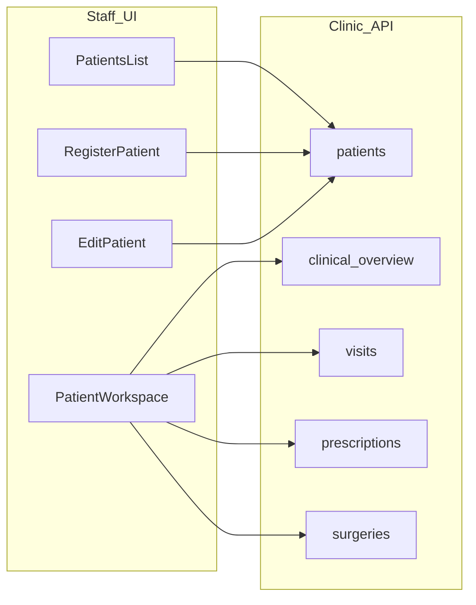

# Staff clinic Patients module — enterprise audit, plan, and implementation

**Last updated:** 2026-03-21 (route-helper hardening: list/detail/edit/register via `lib/staffClinicPatientRoutes.js`; optional query on `staffClinicPatientsPath` for e.g. `ownerId`)  
**Scope:** Branch-scoped staff URLs (all under `/staff/branch/{branchId}/clinic/…`): **`staffClinicPatientsPath`** → `…/patients` (list), **`staffClinicPatientDetailPath`** → `…/patient-detail/{patientId}`, **`staffClinicPatientEditPath`** → `…/patient-edit/{patientId}`, **`staffClinicPatientRegisterPath`** → `…/patient-register`. `patientId` = `Pet.id`. Legacy `…/patients/{numericId}` redirects to patient-detail.

This document is the **single master** for audit + architecture + implementation status.  
**Build execution blueprint:** [STAFF_CLINIC_PATIENTS_404_BUILD_EXECUTION.md](./STAFF_CLINIC_PATIENTS_404_BUILD_EXECUTION.md)  
**Post-register “Patient not found” / list visibility:** [backend-api/docs/CLINIC_PATIENT_REGISTRATION_VISIBILITY_AUDIT_AND_PLAN.md](../../backend-api/docs/CLINIC_PATIENT_REGISTRATION_VISIBILITY_AUDIT_AND_PLAN.md) — **§19–§22** (symptom matrix, canonical `Pet.id`, `listPatients(ownerId)` vs directory, GET patient vs clinical-overview). **Build:** [CLINIC_PATIENT_REGISTRATION_VISIBILITY_BUILD_EXECUTION.md](../../backend-api/docs/CLINIC_PATIENT_REGISTRATION_VISIBILITY_BUILD_EXECUTION.md) — **§L** + **L1–L7** checklist. **Final (2026-03-21):** C1/C2/C3 + clinical-overview **sole mount** on `api/v1/routes.ts`; L3–L5 (`resolvePatientForBranch`, owner-list scope intersection, `formatStaffPatientApiError`); [DEV_API_RUN_AND_DIST.md](../../backend-api/docs/DEV_API_RUN_AND_DIST.md). **Operator:** browser E2E + prod `migrate deploy` where DB lagged.  
**Related contracts:** [backend-api/docs/CLINIC_APP_OWNER_PET_API_CONTRACTS.md](../../backend-api/docs/CLINIC_APP_OWNER_PET_API_CONTRACTS.md)  
**Standalone `/clinic` shell vs staff:** [CLINIC_STANDALONE_VS_STAFF_PATIENT_ROUTES.md](./CLINIC_STANDALONE_VS_STAFF_PATIENT_ROUTES.md) (patient links, options A/B/C). **Cross-shell deployment:** [CROSS_SHELL_NAVIGATION.md](./CROSS_SHELL_NAVIGATION.md).

---

## 1. Problem Summary

Staff clinic URLs such as `/staff/branch/{branchId}/clinic/patients/register` and `/staff/branch/{branchId}/clinic/patients/{id}/edit` were reported as Next.js **“This page could not be found”** (true App Router 404) even though the corresponding `page.jsx` files exist under `app/staff/(larkon)/branch/[branchId]/clinic/patients/`.

**Resolution (2026-03-21):** (1) **Split Next.js configuration** — Turbopack workarounds and redirects lived only in removed `next.config.mjs` while `next dev` loaded `next.config.js`. **Merged into a single `next.config.js`.** (2) **Defense in depth** — **canonical flat routes** for register, **detail**, and edit: `/clinic/patient-register`, `/clinic/patient-detail/[patientId]`, `/clinic/patient-edit/[patientId]` (flat `page.jsx` re-exports the module under `patients/[patientId]/…`). Legacy `/clinic/patients/register`, `/clinic/patients/:numericId`, and `/clinic/patients/:id/edit` **redirect** via `proxy.ts` + `next.config.js` `redirects()`. In-app navigation uses **`lib/staffClinicPatientRoutes.js`** (`staffClinicPatientDetailPath` → **patient-detail**). Bookmarks to `/clinic/patients/4` still work (307 → patient-detail).

---

## 2. Exact 404 root cause analysis

### A. Next.js “no matching route” (true app 404)

| Cause | Evidence / fix |
|--------|----------------|
| **Dual `next.config` (primary, fixed)** | `next.config.js` lacked `experimental.turbopackClientSideNestedAsyncChunking` and other entries that existed only in `next.config.mjs`. Dev (Turbopack) could fail on **nested dynamic** segments (e.g. `.../patients/[patientId]/edit`). **Fix:** merge into `next.config.js`; delete `next.config.mjs`. |
| **Route group** | Pages live under `app/staff/(larkon)/...`; `(larkon)` does **not** appear in the URL. |
| **`src/app` shadow** | If `src/app/staff/.../clinic` existed empty, it could shadow `app/`. **Current:** no staff clinic under `src/app` (only `owner/staff`). |
| **`patients/layout.jsx`** | Exports `dynamic = "force-dynamic"` for route stability. |
| **Wrong panel/port** | Staff `/staff` is associated with **mother** port **3100** per `lib/authRedirect.ts` `PANEL_CONFIG.staff`. Same codebase serves all modes; still verify you are not on an obsolete deployment missing these files. |

### B. HTTP 404 from API (in-app “not found”, not Next 404)

- **Historical:** Patient get/list gated only on appointment → registered-only pets could be invisible. **Now:** branch scope includes **appointment OR visit OR `clinicRegisteredBranchId`** (set on register).
- UI shows a **Patient not found** card when the API returns 404 — distinguish from Next’s generic 404 page.

### C. Access / layout (HTTP 200, blocked UI)

- `clinic/layout.jsx`: non-clinic branch, `clinicEnabled === false`, or no `clinic.*` permission → `AccessDenied` (not Next 404).
- Patients pages need `clinic.patients.read` or `clinic.patients.manage`.

### D. Flat canonical routes (Phase B — **implemented**)

Same pattern as [STAFF_SUPPLY_REQUEST_ROUTE_FIX.md](./STAFF_SUPPLY_REQUEST_ROUTE_FIX.md): `.../patient-register` and `.../patient-edit/[patientId]` are **siblings** of `patients/` (re-export implementation from `patients/register` and `patients/[patientId]/edit`). **`proxy.ts`** and **`next.config.js` `redirects()`** send legacy URLs to the flat paths (query string preserved). **`lib/staffClinicPatientRoutes.js`** is the single place for staff patient URL construction in JSX.

---

## 3. Existing relevant files / routes / APIs

| Area | Location | Notes |
|------|----------|--------|
| Staff list/detail/register/edit | `app/staff/(larkon)/branch/[branchId]/clinic/patients/**` | Canonical branch-scoped UX |
| Standalone clinic panel | `app/clinic/(larkon)/patients/*` | Uses `?branchId=` query |
| Doctor Patients/Visits | `app/doctor/(larkon)/patients/page.tsx` | Visit-centric |
| Staff branch sidebar | `src/lib/branchSidebarConfig.ts` | Patients → `/staff/branch/:id/clinic/patients` |
| Permission registry (clinic panel) | `src/lib/permissionMenu.ts` | `/clinic/patients` for **clinic** app key |
| Next config (canonical) | `next.config.js` | Turbopack flag, redirects, rewrites — **do not reintroduce `next.config.mjs`** |
| API client | `lib/api.ts` | `staffClinicPatientsList`, `staffClinicPatientGet`, `staffClinicPatientClinicalOverview`, register/update, vaccines, etc. |
| Queue walk-in search | `app/staff/.../clinic/queue/page.jsx` | `staffClinicPatientsList` |
| Backend | `clinic.routes.ts`, `patient.service.ts`, `clinic.controller.ts` | CRUD + `clinical-overview` |
| Surgery filter | `surgery.service.ts` / `surgery.controller.ts` | `petId` query |
| Proxy (edge) | `proxy.ts` | Supply-create, doctor URLs, **legacy patient register/edit → flat canonical** |
| Route helpers | `lib/staffClinicPatientRoutes.js` | `staffClinicPatientsPath`, `staffClinicPatientRegisterPath`, `staffClinicPatientDetailPath`, `staffClinicPatientEditPath` |
| Flat register UI entry | `clinic/patient-register/page.jsx` | Re-exports `patients/register/page` |
| Flat edit UI entry | `clinic/patient-edit/[patientId]/page.jsx` | Re-exports `patients/[patientId]/edit/page` |

---

## 4. Current state: complete / partial / missing / broken

| Bucket | Items |
|--------|--------|
| **Complete** | List (search, species filter, pagination), detail workspace (tabs: overview, visits, prescriptions, vaccines, billing, surgery, timeline), **register** page, **edit** page, `clinical-overview`, queue patient search, `clinicRegisteredBranchId`, surgery `petId` filter |
| **Partial** | New appointment from patient detail without owner/pet prefill; billing tab = recent orders only |
| **Fixed** | Register-without-appointment invisible; queue search shape; **dual Next config / Turbopack 404** (2026-03-21) |
| **Complete (Phase B)** | Flat `patient-register` / `patient-edit` + legacy redirects + route helpers |
| **Reuse** | `PageWorkspace`, `BranchHeader`, `AccessDenied`, `Card`, taxonomy selects, `branchSidebarConfig` |

---

## 5. Reusable architecture and components

- **Shell:** `LarkonDashboardShell` via `app/staff/(larkon)/layout.tsx` (`basePath="/staff"`).
- **Branch context:** `useBranchContext(branchId)` for permissions and branch flags.
- **UI primitives:** `BranchHeader`, `Card`, `AccessDenied`, clinic taxonomy components (`SpeciesSelect`, `BreedSelect`, etc.) on register/edit.
- **API:** Centralize staff clinic calls in `lib/api.ts` — avoid ad-hoc `fetch` paths.
- **URLs:** Use `lib/staffClinicPatientRoutes.js` for staff patient list / register / detail / edit links (`Pet.id` for detail + edit).

---

## 6. Recommended final Patients module architecture

---

## 7. Recommended route map

| Route | Purpose |
|-------|---------|
| `/staff/branch/[branchId]/clinic/patients` | Directory |
| `/staff/branch/[branchId]/clinic/patient-register` | **Canonical** registration (use in `Link` / `router.push`) |
| `/staff/branch/[branchId]/clinic/patients/register` | **Legacy** → 307/redirect to `patient-register` |
| `/staff/branch/[branchId]/clinic/patients/[patientId]` | Workspace (`patientId` = `Pet.id`) |
| `/staff/branch/[branchId]/clinic/patient-edit/[patientId]` | **Canonical** edit profile (`Pet.id`) |
| `/staff/branch/[branchId]/clinic/patients/[patientId]/edit` | **Legacy** → redirect to `patient-edit/[patientId]` |
| `/clinic/patients?branchId=` | Standalone **clinic** panel (same APIs, different shell) |

**Note:** App Router folders use `[patientId]` for dynamic pet id. Implementations for register/edit live under `patients/...`; flat routes **re-export** those modules.

---

## 8. Domain mapping

| Concept | System meaning |
|---------|----------------|
| **Patient (UI)** | `Pet` record; route param `patientId` = `pets.id` |
| **Pet** | Same as clinical patient in staff clinic module |
| **Owner** | `User` linked via `Pet.userId`; API field `owner` on patient payloads |
| **Visit** | `Visit.patientId` in Prisma = **owner `User.id`**, not pet id — do not swap when wiring APIs |
| **Appointment** | Links pet/branch/time; intake flows may deep-link to register with query params |
| **Billing** | Recent `Order` rows scoped to branch + visit + pet where applicable |
| **Vaccine** | `Vaccination` on `petId` |
| **Surgery** | `SurgeryCase` filtered by `branchId` + `petId` |

---

## 9. API / data contract expectations

| Method | Path |
|--------|------|
| GET | `/api/v1/clinic/branches/:branchId/patients` |
| GET | `/api/v1/clinic/branches/:branchId/patients/:petId` |
| GET | `/api/v1/clinic/branches/:branchId/patients/:petId/clinical-overview` |
| POST | Register / update via `lib/api.ts` helpers (`staffClinicPatientRegister`, `staffClinicPatientUpdate`) |
| GET | `/api/v1/clinic/branches/:branchId/surgeries?petId=` |

Frontend **must** pass numeric **pet id** for patient-scoped reads/writes. Owner lookup / ensure-owner flows are documented in backend owner-pet contracts.

---

## 10. UI/UX structure

| Page | File | Behavior |
|------|------|----------|
| **List** | `patients/page.jsx` | Search, filters, pagination; links use **`staffClinicPatientRegisterPath`**, `DetailPath`, `EditPath` |
| **Register** | `patients/register/page.jsx` (+ `patient-register/page.jsx` re-export) | Owner existing/new → pet form; query prefill `phone`, `displayName`, `returnTo` |
| **Detail** | `patients/[patientId]/page.jsx` | Tabbed workspace; invalid id in URL → friendly card (no API spam) |
| **Edit** | `patients/[patientId]/edit/page.jsx` (+ `patient-edit/[patientId]/page.jsx` re-export) | Pet profile fields; `clinic.patients.manage`; invalid id → friendly card |

---

## 11. File-by-file implementation plan (summary)

| File | Role |
|------|------|
| `next.config.js` | Turbopack flag, doctor/supply redirects, **legacy patient register/edit → flat** |
| `proxy.ts` | Same legacy patient URL redirects (307, query preserved) |
| `lib/staffClinicPatientRoutes.js` | Canonical path builders (`Pet.id` semantics documented) |
| `patient-register/page.jsx`, `patient-edit/[patientId]/page.jsx` | Re-exports of register/edit implementations |
| `patients/layout.jsx` | `force-dynamic` |
| `patients/page.jsx` | List + row actions → flat register/edit URLs |
| `patients/register/page.jsx` | Full register flow (shared) |
| `patients/[patientId]/page.jsx` | Detail tabs + invalid-id guard |
| `patients/[patientId]/edit/page.jsx` | Edit form + invalid-id guard |
| `lib/api.ts` | Staff clinic patient API wrappers |

Detailed Composer steps: [STAFF_CLINIC_PATIENTS_404_BUILD_EXECUTION.md](./STAFF_CLINIC_PATIENTS_404_BUILD_EXECUTION.md).

---

## 12. Step-by-step execution phases

| Phase | Description | Status |
|-------|-------------|--------|
| **A** | Merge Next config into `next.config.js`; remove `next.config.mjs` | **Done** (2026-03-21) |
| **B** | Flat routes + `proxy.ts` + `redirects()` + route helpers + intake/appointments link updates | **Done** (2026-03-21 hardening) |
| **C** | Docs + QA: clear `.next/<SITE_MODE>`, restart dev, hit **flat** + legacy URLs | Ongoing |

**Historical phases (feature work):** 0–5 (triage, branch scope, list, detail tabs, navigation) — **done**; see archived table in §Appendix A.

---

## 13. Validation checklist

1. **Config:** Only `next.config.js` exists; it exports `experimental.turbopackClientSideNestedAsyncChunking: true` and supply/doctor `redirects`.
2. **Cache:** Delete `.next/<SITE_MODE>` for the dev mode in use; restart `next dev`.
3. **Routes (authenticated):** Open **`.../clinic/patient-register`** and **`.../clinic/patient-edit/{petId}`** — expect app shell (or `AccessDenied`), **not** Next generic 404. Legacy **`.../patients/register`** and **`.../patients/{id}/edit`** should **redirect** to those URLs.
4. **Proxy:** Unauthenticated `/staff/...` should redirect to `/staff/login` (307), not 404.
5. **Data:** Register patient → appears in list; detail loads without prior appointment when `clinicRegisteredBranchId` set.
6. **Permissions:** Without `clinic.patients.read` → `AccessDenied` on patients area.
7. **Standalone clinic:** `/clinic/patients?branchId=` on clinic panel (port 3102) if using that shell.

---

## 14. Risks / deferred items

| Risk / item | Mitigation |
|-------------|------------|
| Migration not applied | Deploy `clinicRegisteredBranchId` migration before relying on register-at-branch |
| Cross-branch data | Server enforces scope; UI shows branch context |
| Turbopack regressions | Flat routes + merged `next.config.js` |
| `src/app` shadow | Do not add empty `src/app/staff/.../clinic` |
| **Deferred product** | Appointment prefill from patient detail; deeper billing; inventory on workspace; notifications |

---

## 15. Final acceptance criteria

- [x] Single canonical **`next.config.js`**; no duplicate `next.config.mjs`.
- [x] Staff clinic **register** and **edit** resolve via **flat canonical URLs** (legacy URLs redirect).
- [x] Branch isolation and `clinic.*` permissions unchanged (layout + page gates only tightened UX).
- [x] No duplicate patient/pet architectures; `patientId` in routes remains `Pet.id`; forms still call existing `lib/api.ts` methods.
- [x] Build execution doc updated for final **Phase A + B** status.

---

## Appendix A — Historical phased plan (0–5)

| Phase | Description | Status |
|-------|-------------|--------|
| **0** | Triage: `src/app` shadow; dev URL/port; Turbopack | Done |
| **1** | Appointment gate vs register-at-branch | Done |
| **2** | Enterprise list; queue → `lib/api` | Done |
| **3** | Detail: overview, visits, vaccines | Done |
| **4** | Prescriptions, billing, surgery, timeline | Done |
| **5** | Clinic vs staff navigation | Done |

---

## Appendix B — Navigation alignment

- **Staff (branch):** `branchSidebarConfig.ts` → `/staff/branch/{branchId}/clinic/patients`.
- **Standalone clinic:** `permissionMenu.ts` → `/clinic/patients` with `branchId` query.

---

## Appendix C — Files touched (historical implementation)

**backend-api:** `prisma/schema.prisma`, migration `pet_clinic_registered_branch`, `patient.service.ts`, `clinic.controller.ts`, `clinic.routes.ts`, `surgery.service.ts`, `surgery.controller.ts`

**bpa_web (404 hardening):** `next.config.js`, `proxy.ts`, `lib/staffClinicPatientRoutes.js`, `patient-register/page.jsx`, `patient-edit/[patientId]/page.jsx`, `patients/page.jsx`, `patients/register/page.jsx`, `patients/[patientId]/page.jsx`, `patients/[patientId]/edit/page.jsx`, intake + appointments register links  

**bpa_web (historical):** `lib/api.ts`, `patients/**` (other), `queue/page.jsx`, `src/lib/permissionMenu.ts` (comments)
