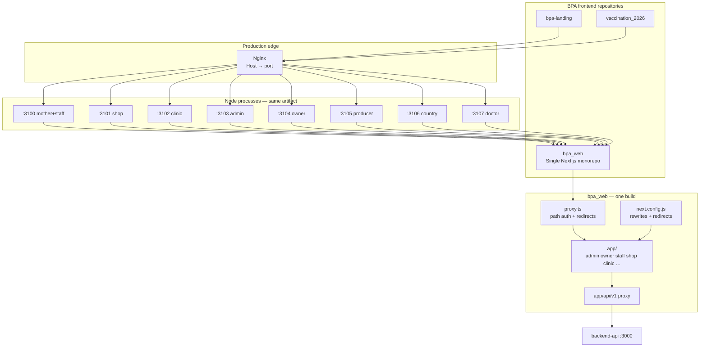

# bpa_web — Deployment Architecture Audit

**Date:** 2026-06-06  
**Scope:** `D:\BPA_Data\bpa_web` (analysis only; no code changes)  
**Question:** Is this one Next.js app with middleware/domain routing (A), or multiple independent Next.js applications (B)?

---

## Executive verdict

| Classification | Answer |
|----------------|--------|
| **Codebase** | **A — Single Next.js monorepo** |
| **Runtime (production)** | **A with optional multi-process fan-out** — same build, path-prefix panels, external nginx hostname → port |
| **Independent apps (B)** | **No** — one `package.json`, one `app/` tree, one `next build` |

`bpa_web` is **not** a set of separate Next.js repositories or projects (mother, shop, clinic, admin, owner, producer as independent apps). It is **one** Next.js 16 application whose panels are isolated by **URL path prefixes** (`/admin`, `/owner`, `/staff`, …), guarded by **`proxy.ts`** (Next 16 middleware replacement), and optionally exposed on **different hostnames/ports** at the edge via nginx.

The `SITE_MODE` environment variable controls **dev cache directories** and **minor SEO/metadata behavior**; it does **not** split the application into separate codebases. Production `next build` compiles **all panels into a single `.next` output**.

---

## 1. Evidence summary

### 1.1 Single application indicators

| Signal | Location | Finding |
|--------|----------|---------|
| One package | `package.json` | Single `"name": "bpa-owner-panel-ui"`, one `next` dependency |
| One build | `package.json` `"build": "next build"` | No per-panel build scripts |
| Unified prod output | `next.config.js` L70 | `distDir: SITE_MODE ? .next/${SITE_MODE} : .next` — **production build omits SITE_MODE → `.next`** |
| All panels in one tree | `app/` | 9 panel roots + shared routes under one App Router |
| Panel validation | `scripts/validate-panel-routes.mjs` | One build manifest must contain **all** panel prefixes |
| Release checklist | `docs/deployment/GITHUB_RELEASE_CHECKLIST.md` | “Production serves a **single** `.next` build” |

### 1.2 What is *not* present

| Expected for B (multiple independent apps) | Status |
|--------------------------------------------|--------|
| Separate `package.json` per panel | ❌ Not found |
| Separate repos or workspaces | ❌ Not found |
| Per-panel `next.config.*` | ❌ Single `next.config.js` |
| Hostname-based routing inside app middleware | ❌ `proxy.ts` uses **pathname only** |
| PM2 ecosystem file in repo | ❌ Not in `bpa_web` (documented in `backend-api` deployment plan only) |
| Docker Compose per panel in `bpa_web` | ❌ Not found |

### 1.3 Related but separate repositories

These are **other** Next.js apps in the BPA ecosystem, not panels inside `bpa_web`:

| Repo | Port | Role |
|------|------|------|
| `bpa-landing` | 3101 | Marketing apex site |
| `vaccination_2026` | 3110 | Campaign booking |

---

## 2. Configuration inspection

### 2.1 `package.json`

**Dev scripts** run the **same codebase** on fixed ports with `SITE_MODE`:

| Script | `SITE_MODE` | Port |
|--------|-------------|------|
| `dev:mother` | mother | 3100 |
| `dev:shop` | shop | 3101 |
| `dev:clinic` | clinic | 3102 |
| `dev:admin` | admin | 3103 |
| `dev:owner` | owner | 3104 (webpack) |
| `dev:producer` | producer | 3105 |
| `dev:country` | country | 3106 |
| `dev:doctor` | doctor | 3107 |
| `dev:all` | all 8 concurrently | 3100–3107 |

**Production script:** `"start": "next start -p 3100"` — single default port; no per-panel `start:*` scripts.

`staff` shares port **3100** with `mother` (same origin in dev); see `lib/authRedirect.ts` `PANEL_CONFIG`.

### 2.2 `next.config.js`

| Feature | Purpose |
|---------|---------|
| `distDir` | Dev: `.next/{SITE_MODE}` for cache isolation; Prod: `.next` |
| `redirects()` | Staff clinic/inventory/warehouse route stability (Turbopack workarounds) |
| `rewrites().beforeFiles` | Internal filesystem aliases for nested dynamic routes |
| `rewrites().fallback` | `/api/v1/*` → backend API (`localhost:3000` or env) |
| `webpack` / `turbopack` aliases | `@larkon`, `@larkon-ui` → shared Larkon template code |

**No hostname or subdomain routing** in Next config.

### 2.3 `proxy.ts` (middleware replacement)

Next.js 16 deprecates `middleware.ts` in favor of `proxy.ts` in this project.

| Concern | Implementation |
|---------|------------------|
| Auth gate | Cookie/header check via `getAuthFromCookies()` |
| Protected prefixes | `/staff`, `/owner`, `/admin`, `/country`, `/shop`, `/clinic`, `/mother` |
| **Not in proxy matcher** | `/producer`, `/doctor` — auth handled in panel layouts |
| Route stability | Redirects/rewrites for staff nested routes (mirrors `next.config.js`) |
| Hostname routing | **None** — all logic is pathname-based |

Login redirects when unauthenticated:

- `/owner/*` → `/owner/login`
- `/admin/*` → `/admin/login`
- `/staff/*` → `/staff/login`
- `/country/*` → `/country/login`
- `/shop`, `/clinic`, `/mother` → `/login`

### 2.4 `app/` structure

**Panel route roots** (primary):

```
app/
├── admin/          # Platform admin (283 pages)
├── owner/          # Organization owner (260 pages)
├── staff/          # Branch staff workspace (163 pages)
├── shop/           # Pet shop panel (14 pages)
├── clinic/         # Standalone clinic shell (28 pages)
├── mother/         # Mother shell (6 pages)
├── producer/       # Producer panel (23 pages)
├── country/        # Country ops (24 pages)
├── doctor/         # Doctor verification panel (26 pages)
├── (public)/       # Marketing landing (owner/producer modes)
├── api/            # Same-origin API proxy routes
├── auth/, login/, register/, invite/, partner/, verify/
├── post-auth-landing/, choose-activity/
└── layout.jsx      # Root layout (SITE_MODE affects metadata)
```

**Route groups:** Panels use `(larkon)/` groups wrapping WowDash/Larkon dashboard shells.

**Shared cross-panel routes:** `post-auth-landing`, `choose-activity`, central `login`, `auth/*`.

### 2.5 `src/` structure

Shared libraries and template code — **not** separate Next apps:

```
src/
├── larkon-admin/    # Larkon admin template (legacy/demo routes)
├── larkon-ui/       # Shared UI primitives
├── bpa/             # BPA domain components
├── components/      # Shared components
├── shared/seo/      # domains.ts, sitemap, metadata
├── lib/             # Analytics, helpers
└── app/             # Legacy API routes (owner branches) — secondary to app/
```

Path aliases: `@/*` → repo root, `@larkon/*`, `@larkon-ui/*`.

### 2.6 Environment (`.env.example`)

| Variable | Role |
|----------|------|
| `NEXT_PUBLIC_API_BASE_URL` | Backend proxy target |
| `NEXT_PUBLIC_AUTH_BASE_URL` | Auth server hint |
| `AUTH_COOKIE_NAME` | Session cookie name |
| `NEXT_PUBLIC_SITE_URL` | Per-deploy canonical URL (comment shows per-subdomain examples) |
| `NEXT_PUBLIC_DEFAULT_PANEL` | Panel routing hint |

`SITE_MODE` is **not** documented in `.env.example`; it is set only via dev scripts.

### 2.7 Deployment configs in repo

| Artifact | Location | Notes |
|----------|----------|-------|
| Release checklist | `docs/deployment/GITHUB_RELEASE_CHECKLIST.md` | Single build, ports 3100–3107 |
| Port/domain map | `backend-api/docs/infrastructure/PORT_AND_DOMAIN_MAP.md` | Canonical ecosystem reference |
| Production plan | `backend-api/docs/deployment/BPA_PRODUCTION_DEPLOYMENT_PLAN.md` | PM2 examples for API, landing, vaccination, admin panel |
| Nginx upstreams | `backend-api/infra/nginx/conf.d/00-upstreams.conf` | Only `bpa_landing:3101`, `bpa_vaccination:3110` today |
| PM2 ecosystem in `bpa_web` | — | **Not committed** |

---

## 3. Panel routes

### 3.1 Panel registry

| Panel | Base path | Dev port | Prod subdomain (planned) | Login route | Page count (approx.) |
|-------|-----------|----------|--------------------------|-------------|----------------------|
| Mother | `/mother` | 3100 | staff.* (shared host) | `/mother/login` | 6 |
| Staff | `/staff` | 3100 | staff.bangladeshpetassociation.com | `/staff/login` | 163 |
| Shop | `/shop` | 3101 | shop.bangladeshpetassociation.com | `/shop/login` | 14 |
| Clinic | `/clinic` | 3102 | clinic.bangladeshpetassociation.com | `/clinic/login` | 28 |
| Admin | `/admin` | 3103 | admin.bangladeshpetassociation.com | `/admin/login` | 283 |
| Owner | `/owner` | 3104 | owner.bangladeshpetassociation.com | `/owner/login` | 260 |
| Producer | `/producer` | 3105 | producer.bangladeshpetassociation.com | `/producer/login` | 23 |
| Country | `/country` | 3106 | internal / TBD | `/country/login` | 24 |
| Doctor | `/doctor` | 3107 | doctor.bangladeshpetassociation.com | `/doctor/login` | 26 |

**Public / shared entry points:**

| Path | Purpose |
|------|---------|
| `/` | Owner marketing landing (`SITE_MODE=owner`) or producer landing (`SITE_MODE=producer`) |
| `/auth/login` | Generic auth entry |
| `/login`, `/register` | Legacy/shared auth |
| `/post-auth-landing` | Post-login role routing (cross-port redirect for doctor in dev) |
| `/choose-activity` | Activity/panel selection |
| `/invite/accept` | Invitation flow |
| `/partner/*` | Partner application |
| `/verify/*` | Verification flows |

**Production build scale:** ~395 routes, 57 layouts (per `docs/audits/PRODUCTION_BUILD_AUDIT.md`).

### 3.2 Hostname-based routing

**Inside the Next.js app:** None. `proxy.ts` and layouts do not read `Host` headers for panel selection.

**At the edge (nginx):** Host-based routing maps subdomains to loopback ports. Documented in `PORT_AND_DOMAIN_MAP.md`:

```
admin.bangladeshpetassociation.com  → 127.0.0.1:3103
shop.bangladeshpetassociation.com    → 127.0.0.1:3101
clinic.bangladeshpetassociation.com → 127.0.0.1:3102
…
```

Each upstream runs the **same** `bpa_web` build. The app still resolves panels by **path** (`/admin`, `/shop`, …), not by hostname logic.

**SEO domain registry:** `src/shared/seo/domains.ts` lists apex and panel subdomains for canonical URLs and CORS hints — configuration only, not runtime routing.

### 3.3 Middleware / proxy rewrites

**`proxy.ts` (request-time):**

- Auth redirects for protected path prefixes
- Legacy URL redirects (staff doctors, patients, inventory, warehouse GRN, pharmacy)
- Internal rewrites for barcode label print and vendor receipt GRN detail

**`next.config.js` (build-time):**

- `redirects()` — permanent/temporary canonical URL migrations
- `rewrites().beforeFiles` — filesystem aliases for Turbopack stability
- `rewrites().fallback` — `/api/v1/*` → backend API

**`app/api/v1/[[...path]]/route.js`:**

- Server-side catch-all proxy when rewrites do not apply (Next 16 regression workaround)
- Forwards cookies; guards against misconfigured API URL pointing at panel ports 3100–3107

### 3.4 Panel isolation strategy

Isolation is **logical** (path + auth), not **physical** (separate apps).

| Layer | Mechanism |
|-------|-----------|
| **URL namespace** | Each panel under `app/{panel}/` with `(larkon)` shell |
| **Edge proxy** | `proxy.ts` cookie check on `/admin`, `/owner`, `/staff`, `/shop`, `/clinic`, `/mother`, `/country` |
| **Layout guards** | Client-side `fetch('/api/v1/.../me')` in panel layouts (admin, owner, doctor, producer, etc.) |
| **API scoping** | Backend enforces role/tenant; admin uses `/api/v1/admin/auth/me` |
| **Cookies** | HttpOnly JWT; **host-scoped** — separate origins in multi-port dev |
| **Cross-shell links** | Relative `/staff/...` from `/clinic` assumes **same origin** — see `docs/CROSS_SHELL_NAVIGATION.md` |
| **Landing isolation** | `app/(public)/` CSS guarded by `scripts/check-landing-isolation.mjs` |
| **SITE_MODE (dev)** | Separate `.next/{mode}` Turbopack cache only |

**Important:** A single `next start` process serves **all** panel paths. Deploying one subdomain per port does **not** hide other panels at the HTTP level unless nginx blocks paths or separate auth domains are used. Isolation relies on auth + API authorization.

---

## 4. Architecture diagram



---

## 5. Required PM2 processes

Two valid deployment patterns exist. The codebase supports both; nginx docs assume **pattern B** for production subdomains.

### Pattern A — Single process (minimal)

One PM2 app serves the unified `.next` build on one port (typically 3100 or behind a single gateway host).

```javascript
// Example — not committed in repo
{
  name: "bpa-web",
  cwd: "/opt/bpa/bpa_web",
  script: "node_modules/.bin/next",
  args: "start -p 3100",
  env: { NODE_ENV: "production" }
}
```

| PM2 name | Port | Notes |
|----------|------|-------|
| `bpa-web` | 3100 | All panels via path prefixes on one host |

**Pros:** One process, one cookie domain, cross-shell `/clinic` ↔ `/staff` works naturally.  
**Cons:** All panels share one origin; subdomain branding requires nginx path routing on one upstream.

### Pattern B — Multi-process (documented production target)

One PM2 app **per panel subdomain**, same git checkout, same `npm run build` artifact, different listen ports. `SITE_MODE` at **start** time is optional (mainly affects `distDir` if set during build — **avoid** setting `SITE_MODE` during production `next build`).

| PM2 name | Port | Host (planned) | `SITE_MODE` at start |
|----------|------|----------------|----------------------|
| `bpa-web-mother` | 3100 | staff.* | optional |
| `bpa-web-shop` | 3101 | shop.* | optional |
| `bpa-web-clinic` | 3102 | clinic.* | optional |
| `bpa-web-admin` | 3103 | admin.* | optional |
| `bpa-web-owner` | 3104 | owner.* | optional |
| `bpa-web-producer` | 3105 | producer.* | optional |
| `bpa-web-country` | 3106 | internal | optional |
| `bpa-web-doctor` | 3107 | doctor.* | optional |

Example from `BPA_PRODUCTION_DEPLOYMENT_PLAN.md` (admin phase):

```bash
pm2 start npm --name bpa-web-admin --cwd /opt/bpa/bpa_web -- run start
# For admin-only port: SITE_MODE=admin next start -p 3103
```

**Required PM2 count:**

| Deployment profile | PM2 processes (bpa_web only) |
|--------------------|------------------------------|
| Minimal / gateway | **1** (`bpa-web`) |
| Full subdomain isolation | **8** (one per port 3100–3107) |
| Phased (admin only) | **1** (`bpa-web-admin` on 3103) |

### Full ecosystem PM2 (reference)

Including non-`bpa_web` services from deployment docs:

| PM2 name | Repo | Port |
|----------|------|------|
| `bpa-api` | backend-api | 3000 |
| `bpa-worker` | backend-api | — |
| `bpa-landing` | bpa-landing | 3101 |
| `bpa-vaccination` | vaccination_2026 | 3110 |
| `bpa-web-*` | bpa_web | 3100–3107 |

**Note:** `bpa-landing` and `bpa_web` shop both use port **3101** in local dev — conflict on one workstation. Production avoids this via separate containers/network namespaces.

---

## 6. Required ports

### Fixed ports (do not change per `BPA_STANDARD.md`)

| Service | Port | Repo |
|---------|------|------|
| Backend API | **3000** | backend-api |
| bpa_web mother + staff | **3100** | bpa_web |
| bpa_web shop | **3101** | bpa_web |
| bpa_web clinic | **3102** | bpa_web |
| bpa_web admin | **3103** | bpa_web |
| bpa_web owner | **3104** | bpa_web |
| bpa_web producer | **3105** | bpa_web |
| bpa_web country | **3106** | bpa_web |
| bpa_web doctor | **3107** | bpa_web |
| bpa-landing (apex) | **3101** | bpa-landing ⚠ dev conflict with shop |
| vaccination_2026 | **3110** | vaccination_2026 |
| Reserved | 3111–3119 | future frontends |

### Port ↔ panel quick reference

```
3100  mother, staff, default npm start
3101  shop          (conflicts with bpa-landing in local dev)
3102  clinic
3103  admin
3104  owner
3105  producer
3106  country
3107  doctor
```

---

## 7. Build and deploy workflow

```bash
# One-time per release (from bpa_web root)
npm ci
npm run build          # unified .next — all panels
npm run validate:panels

# Start (choose pattern A or B)
npm start              # :3100, all routes
# OR
cross-env SITE_MODE=admin next start -p 3103
```

**Pre-build:** `prebuild` runs `scripts/clean-workspace.mjs` (clears `.next` and per-`SITE_MODE` caches).

**Validation pipeline:** `npm run validate:build` = path aliases + vectormap + production deps + build + panel routes.

---

## 8. Risks and operational notes

| Risk | Detail | Mitigation |
|------|--------|------------|
| `dev:all` cache races | 8 concurrent `next dev` with separate `distDir` | Use single-panel dev; `npm run clean:workspace` |
| Cross-port cookies | Dev ports are different origins | `post-auth-landing` redirects doctor to `:3107` explicitly |
| Cross-shell clinic→staff | Relative links need same origin | Single gateway host or env-driven absolute URLs |
| Multi-process ≠ code isolation | Each process still serves all routes in build | Rely on auth; optionally nginx `location` blocks |
| Nginx panel vhosts | Not all in VCS yet | Only landing + vaccination configured in `infra/nginx/` |
| Image domains | `next/image` may reject prod API host | Extend `buildImageRemotePatterns()` in `next.config.js` |

---

## 9. Conclusion

**`bpa_web` is architecture A:** a **single Next.js application** with:

- **Path-prefix panel routing** (`/admin`, `/owner`, `/staff`, …)
- **`proxy.ts`** for auth and route stability (not hostname routing)
- **Optional multi-process deployment** where nginx maps subdomains to ports 3100–3107 — still the **same build**, not independent applications

It is **not architecture B** (multiple independent Next.js codebases). The eight “panels” are **route namespaces** inside one monorepo, sharing `next.config.js`, `proxy.ts`, API proxy, and Larkon UI infrastructure.

For canonical port and domain mapping across the full ecosystem, see `backend-api/docs/infrastructure/PORT_AND_DOMAIN_MAP.md`.

---

## 10. Files inspected

| Path | Role |
|------|------|
| `package.json` | Scripts, ports, SITE_MODE |
| `next.config.js` | distDir, redirects, rewrites, images |
| `proxy.ts` | Auth middleware replacement |
| `app/layout.jsx`, `app/(public)/page.tsx` | SITE_MODE metadata/landing |
| `app/*/layout.*` | Panel layout guards |
| `lib/authRedirect.ts`, `lib/authHelpers.ts` | Panel ports, public paths |
| `src/shared/seo/domains.ts` | Production subdomain registry |
| `scripts/validate-panel-routes.mjs` | Panel route validation |
| `scripts/clean-workspace.mjs` | SITE_MODE cache dirs |
| `.env.example` | Deploy env contract |
| `PROJECT_CONTEXT.md`, `docs/BPA_STANDARD.md` | Port rules |
| `docs/deployment/GITHUB_RELEASE_CHECKLIST.md` | Release gates |
| `docs/CROSS_SHELL_NAVIGATION.md` | Panel isolation assumptions |
| `docs/audits/PRODUCTION_BUILD_AUDIT.md` | Build architecture snapshot |
| `backend-api/docs/infrastructure/PORT_AND_DOMAIN_MAP.md` | Ecosystem ports/domains |
| `backend-api/docs/deployment/BPA_PRODUCTION_DEPLOYMENT_PLAN.md` | PM2 examples |
| `backend-api/infra/nginx/conf.d/00-upstreams.conf` | Nginx upstreams |
