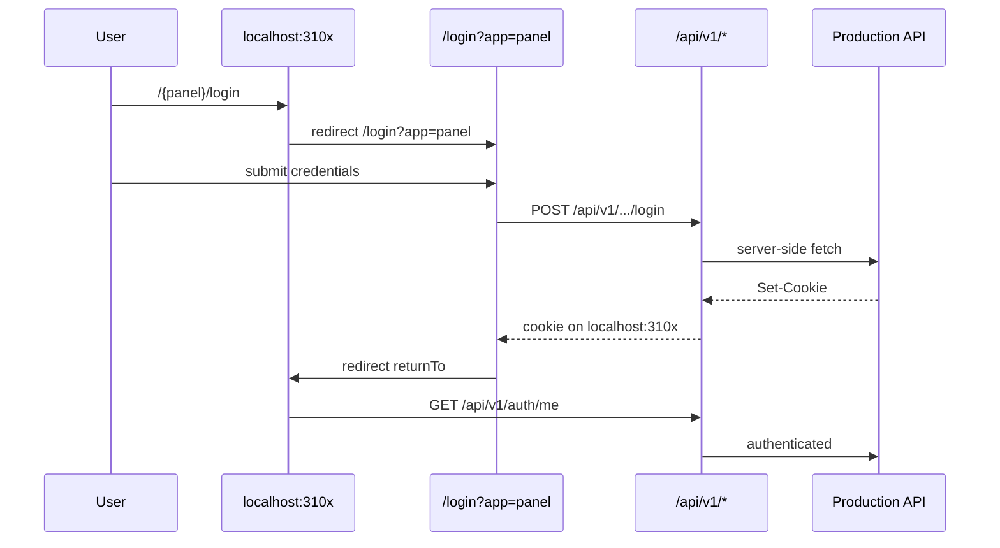

# Same-Origin Auth Migration Report

**Date:** 2026-06-07  
**Scope:** `bpa_web` frontend only (backend/VPS unchanged)

## Summary

All panel login and register entry routes now redirect to **same-origin** `/login?app=<panel>` or `/register?app=<panel>`. Authentication API calls use **`/api/v1/*`** through the Next.js proxy. The browser no longer navigates to `https://api.bangladeshpetassociation.com/auth/login`.

---

## Core auth changes

| File | Change |
|------|--------|
| `lib/authRedirect.ts` | `buildAuthUrl()` always returns `/login?…` or `/register?…` (never external `/auth/login`). `getAuthRedirectUrl()` updated. `getLoginPathForPanel()` returns `/login?app=…`. `getAuthBaseUrl()` returns `""` in browser. |
| `src/bpa/components/AuthRedirectPage.tsx` | Docs/messaging updated; still redirects via `getAuthRedirectUrl()` → same-origin. |
| `app/auth/login/page.tsx` | Legacy `/auth/login` → `/login?app=…` directly (skips `/{panel}/login` hop). |
| `app/owner/login/page.tsx` | Adds `app=owner` when redirecting to `/login`. |
| `app/login/page.jsx` | Extended `isProtectedPath` for `/producer`, `/doctor`. |
| `app/register/page.jsx` | `apiGet` uses `getBrowserSafeApiBase()`; post-register redirect preserves `app` param. |

---

## Panel login / register routes fixed

All of these use `AuthRedirectPage`, which now resolves to same-origin URLs:

| Panel | Port | Login route | Resolves to |
|-------|------|-------------|-------------|
| Mother | 3100 | `/mother/login` | `/login?app=mother&returnTo=…` |
| Shop | 3101 | `/shop/login` | `/login?app=shop&returnTo=…` |
| Clinic | 3102 | `/clinic/login` | `/login?app=clinic&returnTo=…` |
| Admin | 3103 | `/admin/login` | `/login?app=admin&returnTo=…` |
| Owner | 3104 | `/owner/login` → `/login?app=owner` | Same-origin |
| Producer | 3105 | `/producer/login` | `/login?app=producer&returnTo=…` |
| Country | 3106 | `/country/login` | `/login?app=country&returnTo=…` |
| Doctor | 3107 | `/doctor/login` | `/login?app=doctor&returnTo=…` |
| Staff | 3100 | `/staff/login` | `/login?app=staff&returnTo=…` (unchanged) |

Register routes (`/{panel}/register`) → `/register?app=<panel>&returnTo=…`.

---

## Browser API base fixes (no direct production calls from client)

| File | Fix |
|------|-----|
| `src/lib/useMe.ts` | Uses `getBrowserSafeApiBase()` for `/auth/me`, `/me`, `/admin/auth/me` |
| `src/bpa/lib/useMe.js` | Same pattern |
| `src/lib/apiFetch.js` | Browser always returns `""` |
| `src/bpa/apiClient.js` | Browser always returns `""` |
| `src/bpa/api/client.js` | Browser `API_BASE = ""` |
| `app/register/page.jsx` | Invite/auth check via proxy |
| `src/app/owner/logout/page.jsx` | `POST /api/v1/auth/logout` same-origin |
| `app/owner/_lib/ownerApi.ts` | `getCatalogBase()` uses same-origin in browser |
| `lib/useDoctorSocket.ts` | Socket connects to `window.location.origin` |
| `lib/useNotifications.ts` | Socket uses same-origin |
| `lib/constants.ts` | Added `resolveClientApiBase()` |
| Location pickers (8 files) | Browser `API_BASE = ""` |
| Owner org/KYC/profile components (20+ files) | Browser `API_BASE = ""` |

Server-side rendering still uses `NEXT_PUBLIC_API_BASE_URL` for SSR fetches only.

---

## Login flow (all panels)

---

## Remaining production blockers (external / non-auth)

These are **not** fixed by this migration (backend/VPS unchanged):

| Blocker | Impact |
|---------|--------|
| Production `CORS_ORIGINS` excludes `localhost:3100–3107` | Only affects **direct** cross-origin browser calls; same-origin proxy unaffected |
| Production admin whitelist (`SuperAdminWhitelist`, `ADMIN_*` env) | Admin `/admin/auth/me` may return 403 for non-whitelisted users |
| Live production database | Authenticated proxy sessions still mutate production data |
| WebSocket through proxy | Same-origin Socket.IO may depend on Next/proxy WebSocket support |
| `` to absolute file URLs | Some legacy components may still build absolute URLs for SSR; browser paths use `/api/v1/files/…` |
| `NEXT_PUBLIC_AUTH_BASE_URL` in `.env.local` | No longer used for browser navigation; safe to keep for SSR hints only |

---

## Verification checklist

1. `npm run dev:all`
2. Open `http://localhost:3102/clinic/login` → should land on `http://localhost:3102/login?app=clinic&…` (not production auth host)
3. DevTools Network: login POST goes to `localhost:3102/api/v1/auth/login`
4. Repeat for shop (3101), producer (3105), country (3106), mother (3100)
5. Confirm no navigation to `api.bangladeshpetassociation.com/auth/login`

---

## Files changed (complete list)

- `lib/authRedirect.ts`
- `lib/constants.ts`
- `lib/useDoctorSocket.ts`
- `lib/useNotifications.ts`
- `src/bpa/components/AuthRedirectPage.tsx`
- `src/lib/useMe.ts`
- `src/bpa/lib/useMe.js`
- `src/lib/apiFetch.js`
- `src/bpa/apiClient.js`
- `src/bpa/api/client.js`
- `src/app/owner/logout/page.jsx`
- `app/auth/login/page.tsx`
- `app/login/page.jsx`
- `app/register/page.jsx`
- `app/owner/login/page.tsx`
- `app/owner/_lib/ownerApi.ts`
- `app/owner/onboarding/_hooks/useOnboarding.ts`
- `app/owner/kyc/_lib/kycApi.ts`
- `app/owner/kyc/_components/OwnerKycClientPage.tsx`
- `app/owner/kyc/_components/KycDocumentsForm.tsx`
- `app/owner/(larkon)/products/[id]/page.tsx`
- `app/owner/(larkon)/integrations/product-import/[batchId]/page.tsx`
- `app/owner/(larkon)/organizations/[id]/page.jsx`
- `app/owner/(larkon)/organizations/[id]/edit/page.jsx`
- `app/owner/(larkon)/organizations/[id]/registration/page.jsx`
- `app/owner/(larkon)/organizations/[id]/payouts/page.jsx`
- `app/owner/(larkon)/organizations/new/page.jsx`
- `app/owner/(larkon)/organizations/_components/OrganizationWizardForm.jsx`
- `app/owner/(larkon)/profile/page.jsx`
- `app/owner/(larkon)/team/page.jsx`
- `app/owner/_components/*` (location pickers, ImageUploader, NotificationBadge, ContextSelector)
- `app/producer/kyc/page.jsx`
- `app/admin/(larkon)/health/page.tsx`
- `components/LocationPicker.jsx`
- `components/location/LocationPicker.tsx`
- `components/location/locationMasterClient.ts`
- `components/common/LocationPickerUnified.tsx`
- `src/components/MapPicker.tsx`
- `src/components/location/bd/BdHierarchyPicker.tsx`
- `docs/audits/SAME_ORIGIN_AUTH_MIGRATION_REPORT.md` (this file)

Panel login/register pages (`AuthRedirectPage` consumers) unchanged structurally; behavior fixed via `lib/authRedirect.ts`.
