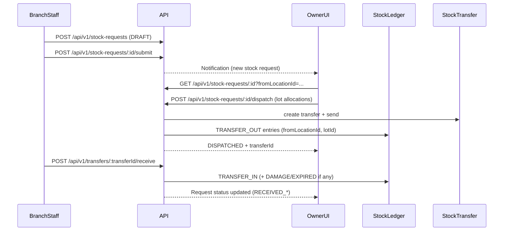

## Master Plan — Owner Team + Central/Multi-Warehouse + Unified Catalog + Requests

Date: 2026-02-04

Source-of-truth planning docs for this initiative:\n+- `docs/master-plan/BASELINE_REPO_STATE.md` (facts)\n+- `docs/master-plan/GAPS_AND_DECISIONS.md` (decisions)\n+- `docs/master-plan/MASTER_PLAN.md` (this file)\n+- `docs/master-plan/EXECUTION_PLAYBOOK.md` (how to implement safely)

---

## Master Vision (must-have)

We need a scalable system that supports:

- **A) Unified Product Catalog** (same products online/offline) per org
- **B) Inventory per-location** (Warehouse/Branch/Store/VIRTUAL), ledger-auditable
- **C) Requests Hub for owner**: `/owner/requests`
- **D) Separate request flows**:\n+  - Catalog/Product-change approvals: `/owner/product-requests/[id]`\n+  - Stock requests: `/owner/inventory/stock-requests` and `/owner/inventory/stock-requests/[id]`\n+    - partial fulfill\n+    - add extra items\n+    - decline with clear reason/source
- **E) Central warehouse now (one)** + multi-warehouse later (routing rules)
- **F) Owner can delegate operations to many people (Owner Team)**:\n+  - `OWNER_ADMIN`, `INVENTORY_MANAGER`, `WAREHOUSE_STAFF`, `CATALOG_MANAGER`, `FINANCE`, `AUDITOR`\n+  - permissions must support scope by location/branch
- **G) Monitoring & workforce scaling**:\n+  - work queues (pick/pack/dispatch/receiving)\n+  - notifications with dedupe keys + action URLs\n+  - discrepancy logs (damage/shortage), expiry tracking

---

## Non-negotiable constraints

- Fixed ports (do not change scripts): API `3000`, Owner `3104`.
- Backward compatible only: do not delete existing code; obsolete paths become **DEPRECATED** but continue to work.
- Reuse existing patterns:\n+  - ledger/lot rules (`StockLedger`, `StockLot*`)\n+  - existing request models (`ProductChangeRequest`, `StockRequest`)\n+  - auth + permission resolution (`resolvePermissionsForUser`)\n+  - WowDash UI patterns in Owner panel

---

## Current building blocks we will reuse (facts)

From `docs/master-plan/BASELINE_REPO_STATE.md`:

- **Ledger + lots/expiry**: `backend-api/src/api/v1/modules/inventory/ledger.service.ts`
- **Stock Requests (branch → owner dispatch)**: `/api/v1/stock-requests/*`
- **Transfers (lot-backed)**: `/api/v1/transfers/*` with discrepancy support
- **Catalog change requests**: `ProductChangeRequest` + `/api/v1/owner/product-change-requests/*`
- **RBAC tables exist**: `Role`, `Permission`, `OrgMemberRole`, `BranchMemberRole` (Prisma)
- **Permission resolver exists**: `backend-api/src/api/v1/utils/permissions.js`
- **Notifications service exists**: `backend-api/src/api/v1/services/notification.service.ts`

Key known placeholders we will replace (additively):
- `GET /api/v1/owner/requests` (currently mock)
- `/api/v1/owner/product-requests*` (currently mock; we will align it to real `ProductChangeRequest`)

---

## Architecture overview (catalog vs stock separation, per-location inventory)

### Conceptual separation

- **Catalog plane (what exists)**\n+  - `Product`, `ProductVariant`, `LocationVariantConfig`, `LocationPrice`\n+  - Product change requests: `ProductChangeRequest`\n+- **Stock plane (what moves)**\n+  - `InventoryLocation` + `StockLedger` (immutable) + `StockBalance`\n+  - `StockLot` (batch/expiry) + `StockLotBalance`\n+  - `StockRequest` and `StockTransfer` (dispatch/receive)

### Central warehouse representation (Phase-1)

- A warehouse is a **Branch** of type `WAREHOUSE_DC` with one or more `InventoryLocation` rows.\n+- “Warehouse stock” is the stock at an `InventoryLocation` selected as `fromLocationId` for dispatch.

### Multi-warehouse (Phase-3)

- Multiple `WAREHOUSE_DC` branches per org.\n+- Routing rules choose a preferred warehouse per destination branch/order.\n+- Manual override remains possible (Owner Team).

### High-level flow (stock request)



---

## Data model proposal (tables/enums, including scope fields)

### Existing core models (keep; already in Prisma)

- Catalog:\n+  - `Product`, `ProductVariant`\n+  - `ProductChangeRequest`\n+  - `LocationVariantConfig`, `LocationPrice`\n+- Inventory (ledger/lot):\n+  - `InventoryLocation`\n+  - `StockLedger`, `StockBalance`\n+  - `StockLot`, `StockLotBalance`\n+- Requests/Transfers:\n+  - `StockRequest`, `StockRequestItem`\n+  - `StockTransfer`, `StockTransferItem`\n+  - `StockDiscrepancy`, `StockAdjustmentRequest`\n+- RBAC:\n+  - `RoleScope`, `Role`, `Permission`, `RolePermission`\n+  - `OrgMemberRole`, `BranchMemberRole`\n+  - `UserGlobalRole`, `UserCountryRole`, `UserStateRole`\n+- Warehouse hinting:\n+  - `BranchType` (codes include `WAREHOUSE_DC`) + link tables

### Minimal DB changes (Phase-1 must-have)

To make “decline with clear reason/source” unambiguous for stock requests:

- Add fields to `StockRequest` (additive):\n+  - `cancelledAt DateTime?`\n+  - `cancelledByUserId Int?`\n+  - `cancelSource StockRequestCancelSource?` (enum: `BRANCH|OWNER`)\n+  - `cancelReason String?` (Text)\n+
This keeps existing `status=CANCELLED` but makes the **who/why** explicit.

### Phase-2 hooks (recommended)

- Add GRN / Receipts:\n+  - `GoodsReceipt` (orgId, warehouseLocationId, vendorId?, status, createdByUserId, createdAt)\n+  - `GoodsReceiptItem` (receiptId, variantId, lotId or lotCode+dates, qty, cost)\n+  - Ledger link via `refType='GRN'`, `refId=receiptId`\n+- Add a generic `RequestNote` table for audit trails:\n+  - (refType, refId, body, createdByUserId, createdAt)

### Phase-3/4 (optional, scale features)

- Multi-warehouse routing:\n+  - `WarehouseRoutingRule` (orgId, destBranchId, warehouseBranchId, priority, isActive, constraintsJson)\n+- Workforce queues:\n+  - `WorkQueueTask` (type PICK|PACK|DISPATCH|RECEIVE, refType/refId, assignedToUserId?, status, SLA fields)\n+- Location-level access:\n+  - `LocationAccessPermission` (locationId, userId, status, roleId or permission scope)

---

## Route map (Owner sidebar + all pages)

### Owner — Requests Hub (inbox)

- `/owner/requests`\n+  - Unified queue for:\n+    - Catalog change requests\n+    - Stock requests\n+    - Adjustment requests\n+    - Transfer disputes\n+    - Notifications\n+
### Owner — Catalog/Product-change approvals

- `/owner/product-requests` (list)\n+- `/owner/product-requests/[id]` (detail)\n+
Implementation intent:\n+- UI routes remain.\n+- Backend wiring aligns to `ProductChangeRequest` (real DB-backed flow).

### Owner — Inventory (warehouse-centric)

Inventory stays the operational “home” for stock:

- `/owner/inventory` (overview)\n+- `/owner/inventory/warehouse` (warehouse location picker + stock)\n+- `/owner/inventory/stock-requests` (list)\n+- `/owner/inventory/stock-requests/[id]` (detail: partial fulfill + add extra items + decline)\n+- `/owner/inventory/transfers` (+ `/[id]`, `/new`)\n+- `/owner/inventory/receipts` (GRN / inbound)\n+- `/owner/inventory/adjustments` (requests + approvals)\n+- `/owner/inventory/batches` (lots/expiry views)\n+
Note: Some routes exist today; missing ones are introduced incrementally.

### Staff (Branch)

- `/staff/branch/[branchId]/inventory/stock-requests` (+ `/new`, `/[id]`) already exist and keep working.

---

## API map (endpoints, payload shapes, permissions)

This plan prefers **additive endpoints** and reuses existing namespaces when already in use by UI.

### 1) Owner Requests Hub (aggregate)

- `GET /api/v1/owner/requests`\n+  - Returns list + `meta.pendingCounts`.\n+  - Must support `?summary=1` for lightweight counts (used by `bpa_web/app/owner/_hooks/useEntityCounts.js`).\n+
Suggested response shape (compatible with current UI expectations):

```json
{
  "success": true,
  "data": [
    {
      "id": "SR-123",
      "ref": "SR-123",
      "kind": "STOCK_REQUEST",
      "title": "Stock request from Gulshan Branch",
      "summary": "3 item(s)",
      "status": "SUBMITTED",
      "branch": { "id": 21, "name": "Gulshan Branch" },
      "createdAt": "2026-02-04T10:00:00.000Z",
      "href": "/owner/inventory/stock-requests/123",
      "meta": { "stockRequestId": 123 }
    }
  ],
  "meta": {
    "pendingCounts": { "inbox": 5, "productRequests": 2, "transfers": 1, "adjustments": 1, "returns": 0, "cancellations": 0, "notifications": 1 },
    "total": 10
  }
}
```

### 2) Catalog/Product-change requests

Keep the real DB-backed flow:\n+- Create: `POST /api/v1/branches/:branchId/product-change-requests`\n+- Owner list: `GET /api/v1/owner/product-change-requests?status=PENDING`\n+- Owner approve/reject:\n+  - `PATCH /api/v1/owner/product-change-requests/:id/approve`\n+  - `PATCH /api/v1/owner/product-change-requests/:id/reject`\n+
Backward compatibility:\n+- Keep `/api/v1/owner/product-requests*` endpoints working.\n+- Mark them **DEPRECATED** and internally map them to the same `ProductChangeRequest` logic (so `/owner/product-requests/[id]` becomes real).

### 3) Stock requests

Existing endpoints (already used by both Staff + Owner UI):\n+- `POST /api/v1/stock-requests`\n+- `GET /api/v1/stock-requests`\n+- `GET /api/v1/stock-requests/:id?fromLocationId=`\n+- `POST /api/v1/stock-requests/:id/dispatch`\n+
Phase-1 additions (owner decline + reason/source):\n+- `POST /api/v1/stock-requests/:id/decline` (owner)\n+  - body: `{ reason?: string }`\n+  - sets `status=CANCELLED` + cancellation fields (`cancelSource=OWNER`, etc.)\n+
Fulfillment requirements:\n+- Partial fulfill is already supported by sending fewer allocations.\n+- “Add extra items” is already supported by sending allocations for variants not present in `StockRequestItem[]` (audited via transfer items + ledger).\n+
### 4) Transfers

Keep lot-backed behavior:\n+- `POST /api/v1/transfers` requires `lotId` per item (allocations).\n+- Owner UI must use `GET /api/v1/inventory/fefo` or `GET /api/v1/inventory/lots` to pick lots.\n+
### 5) Inventory / receipts / expiry

Existing:\n+- `GET /api/v1/inventory/locations`\n+- `GET /api/v1/inventory/lots`\n+- `GET /api/v1/inventory/expiring`\n+- `POST /api/v1/inventory/opening` (inbound stock, lot required)\n+
Phase-2:\n+- Introduce `/api/v1/inventory/receipts/*` (GRN) while keeping `opening` for dev/backfill.\n+
### 6) RBAC (Owner Team)

Existing admin endpoints:\n+- `/api/v1/admin/roles`\n+- `/api/v1/admin/permissions`\n+- `/api/v1/admin/user-roles/*` (global/country assignments)\n+
Phase-1/2 additions:\n+- Seed org/branch roles for Owner Team using existing seed patterns (`prisma/seeders/seedRolesPermissions.ts`).\n+- Add `panel.owner` permission and assign to Owner Team roles.\n+
---

## Notification map (events, dedupeKey patterns, actionUrl)

We will use `createNotification()` (`backend-api/src/api/v1/services/notification.service.ts`) and follow a consistent dedupe scheme.

### Core events

- Stock request submitted\n+  - event: `stock_request.submitted`\n+  - dedupeKey: `stock_request_submitted:{stockRequestId}`\n+  - actionUrl: `/owner/inventory/stock-requests/{stockRequestId}`\n+- Stock request declined\n+  - dedupeKey: `stock_request_declined:{stockRequestId}`\n+  - actionUrl: same as above\n+- Product change request created\n+  - dedupeKey: `product_change_request_created:{requestId}`\n+  - actionUrl: `/owner/product-requests/{requestId}`\n+- Transfer disputed\n+  - dedupeKey: `transfer_disputed:{transferId}`\n+  - actionUrl: `/owner/transfers/{transferId}`\n+- Lot expiring alerts (optional)\n+  - dedupeKey: `lot_expiring:{locationId}:{lotId}`\n+  - actionUrl: `/owner/inventory/batches?locationId=...`

### Notification types

- Current `NotificationType` enum includes `SYSTEM`; Phase-1 uses `SYSTEM` with `meta` payloads.\n+- Later we can extend enum with domain-specific types if needed (additive).

---

## Rollout phases (incremental) with acceptance criteria

### Phase 1 — Requests hub + stock request flow end-to-end (one warehouse selector)

Acceptance criteria:
- `/owner/requests` shows:\n+  - Product change requests (`ProductChangeRequest`)\n+  - Stock requests (`StockRequest`)\n+  - Adjustment requests (`StockAdjustmentRequest`)\n+- `/owner/product-requests/[id]` is wired to real data (no mock-only behavior).\n+- `/owner/inventory/stock-requests/[id]` supports:\n+  - partial fulfill\n+  - add extra items\n+  - owner decline with stored reason/source\n+- Warehouse selector:\n+  - Owner can select a **warehouse location** (`fromLocationId`) from locations under branches typed `WAREHOUSE_DC`.\n+- Notifications created on stock request submit and product change request create (deduped).

### Phase 2 — Receipts/GRN + transfers integration + discrepancy logs

Acceptance criteria:
- GRN/receipt UI exists and creates inbound stock with lots.\n+- Dispatch/receive flows expose discrepancy details and evidence.\n+- Expiry views are available for warehouse locations.

### Phase 3 — Central warehouse hardening + multi-warehouse routing rules (optional)

Acceptance criteria:
- Multiple `WAREHOUSE_DC` branches supported.\n+- Routing rule table exists and drives default warehouse suggestion.\n+- Manual overrides remain possible.\n+- Performance considerations: requests hub can paginate and filter by org/branch/type.

### Phase 4 — Workforce queues + scanning (optional)

Acceptance criteria:
- Pick/pack/dispatch/receive tasks can be assigned and tracked.\n+- Basic barcode scanning flows exist (lot/variant validation).\n+- Audit view for actions per user + per warehouse.

---

## Backward compatibility guarantees

- Ports and scripts remain unchanged.\n+- Existing routes remain reachable; new pages are additive.\n+- Existing APIs (`/api/v1/stock-requests`, `/api/v1/transfers`, `/api/v1/inventory`) keep behavior; new endpoints are additive.\n+- Existing mock endpoints under `/api/v1/owner/*` remain available but are marked **DEPRECATED** and internally backed by real models (no breaking client changes).\n+- Inventory remains ledger-driven; no second movement system is introduced.

