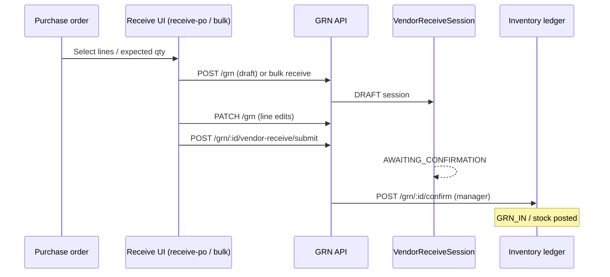

# Vendor Receipts (GRN) — Warehouse Receiving Module Redesign

**Status:** Planning only — **no implementation in this document.**  
**Panel:** Staff Warehouse (Larkon Admin, App Router), dev port **3104**.  
**Canonical staff URLs today:** list/queue lives under `receive-po`; GRN detail is exposed as `/staff/branch/[branchId]/warehouse/vendor-receipts/[grnId]` with a `next.config.js` rewrite to a flat route segment for Turbopack stability (see `next.config.js` + `proxy.ts`).

This plan aligns the **product UX** (dashboard + tabs + detail + print + history) with **existing backend capabilities** (`/api/v1/grn`, vendor receive session states, HTML print pipeline) and calls out **gaps** to close during implementation.

---

## 0. Goals and non-goals

### Goals

- Turn “vendor receipts” into a **complete receiving module**: at-a-glance summary, filtered smart list, first-class detail, confirm/post flow, printables, and discoverable history.
- **Strict Larkon Admin parity:** reuse existing card/table/badge/button patterns, spacing, and typography (reference `receive-po`, warehouse dashboard, pick-lists pages — no visual redesign language).
- **Branch-scoped correctness:** all queries include `orgId` + `branchId` (and optionally `warehouseId` / `locationId` when multi-location per branch is relevant).

### Non-goals (for initial delivery)

- Replacing the **bulk PO receive** editor (`BulkReceivePage`) — it remains the heavy “create lines” surface; the new list page **orchestrates** access to it.
- PDF server rendering (e.g. Puppeteer) unless explicitly added later — **phase 1** uses the existing **HTML + browser print** approach (`printDocuments.service.ts` pattern).

---

## 1. Page structure (UI/UX)

### 1.1 Layout shell

- Reuse **`StaffBranchLayout`** + warehouse access gate pattern (same as `warehouse/receive-po/page.tsx` and `WarehouseAccessFallback`).
- Page header row: title **Vendor receipts**, optional subtitle (“Goods received notes for this warehouse”), primary actions on the right (see §1.5).

### 1.2 Top summary cards (`VendorReceiptSummaryCards`)

Four KPI cards in a single responsive row (Larkon `row` + `col-*` / card components used elsewhere on warehouse pages):

| Card | Definition (branch-scoped vendor GRNs) | Primary data source |
|------|----------------------------------------|------------------------|
| **Pending confirmation** | GRN `status === DRAFT` **and** `vendorReceiveSession.status === AWAITING_CONFIRMATION` | `GET /api/v1/grn/pending-count?orgId&branchId` → `awaitingConfirmation` (already exists) |
| **Draft** | GRN `DRAFT` **and** session `DRAFT` (editable before submit) | same endpoint → `draftVendorReceives` |
| **Total received (today)** | GRNs with `status === RECEIVED` where `receivedAt` (or confirmed/posted timestamp — confirm field in API payload) is **today (local or org TZ — pick one and document)** | **Gap:** not in `pending-count`; see §10 |
| **Discrepancy / exceptions** | Count of GRNs (draft or awaiting) where **any line** has `quantityDamaged`, `quantityShort`, or `quantityExtra` > 0, **or** non-empty `lineDiscrepancyNote` | **Gap:** likely needs **summary endpoint** or lightweight aggregate query; avoid scanning full pages client-side for scale |

**UX notes**

- Cards are **clickable filters** where sensible (e.g. Pending → switches tab + applies `sessionStatus=AWAITING_CONFIRMATION`).
- Show skeleton loaders for cards; on error, inline `alert-soft` style message (existing toast pattern).

### 1.3 Tabs (segmented control or Larkon nav-tabs)

Three tabs, backed by **query state** (e.g. `?tab=pending|draft|history`) so URLs are shareable:

| Tab | Filter logic |
|-----|----------------|
| **Pending confirmation** | `status=DRAFT&sessionStatus=AWAITING_CONFIRMATION` |
| **Draft** | `status=DRAFT&sessionStatus=DRAFT` |
| **Confirmed / history** | `status=RECEIVED` (and optionally `VOIDED` in an “All” sub-filter later — keep v1 simple) |

**Empty tab copy:** short explanation + CTA (see §6).

### 1.4 Smart list — table (`VendorReceiptTable`)

**Toolbar above table (`VendorReceiptFilters`):**

- Search: vendor name, PO number, GRN id (client filter **only if** dataset small; prefer server `purchaseOrderId` / `vendorId` once exposed — see backend gaps).
- Date range: maps to `dateFrom` / `dateTo` on `GET /api/v1/grn` (already supported server-side).
- Optional: Vendor select (needs vendor list API or reuse branch vendors if already loaded in context).
- Pagination controls mirroring other warehouse tables.

**Columns (v1):**

| Column | Source / notes |
|--------|----------------|
| **GRN ID** | `id` — link to detail route |
| **Vendor** | `vendor.name` |
| **PO ref** | `purchaseOrder.poNumber` or `—` |
| **Qty (expected vs received)** | For PO-linked lines: sum `purchaseOrderLine.orderedQty` vs sum **received** (`quantity` + extras model per business rule — **align with print doc**: stock-added uses `quantity + quantityExtra` in `renderGrnPrintHtml`). Show compact `exp / rec` with badge if mismatch. |
| **Status** | Composite badge: GRN `status` + session `status` (e.g. “Draft”, “Awaiting manager”, “Posted”) |
| **Date** | Prefer `createdAt`; for history show `receivedAt` or `vendorReceiveSession.confirmedAt` if present in list payload |
| **Actions** | **View**, **Print** (dropdown), **Continue receive** (draft only), **Submit** (if user can), **Confirm** (manager only, if awaiting) — visibility per §7 |

**States:** loading skeleton rows, empty (§6), error banner + retry.

### 1.5 Primary actions (header)

- **Create new receive** → navigates to existing flow: `/staff/branch/[branchId]/warehouse/receive-po` with optional `?purchaseOrderId=` prefill (already documented on that page).
- Optional secondary: **Import from PO** (same as above — wording only).

---

## 2. Routing design

### 2.1 Staff path prefix

All staff warehouse routes are under:

`/staff/branch/[branchId]/warehouse/...`

The user-facing “short” paths in requirements map as:

| Requirement | Staff canonical path |
|-------------|-------------------------|
| List: `/warehouse/vendor-receipts` | `/staff/branch/[branchId]/warehouse/vendor-receipts` |
| Detail: `/warehouse/vendor-receipts/[grnId]` | `/staff/branch/[branchId]/warehouse/vendor-receipts/[grnId]` |

### 2.2 Filesystem vs Turbopack rewrite

**Today:** `next.config.js` rewrites `vendor-receipts/:grnId` → `vendor-receipt-grn-detail-page/:grnId` for nested dynamic stability.

**Plan:**

1. **List page:** add `app/staff/(larkon)/branch/[branchId]/warehouse/vendor-receipts/page.tsx` (new module shell).
2. **Detail page:** either  
   - **A (preferred):** keep public URL `vendor-receipts/[grnId]` and **extend** rewrite to the same flat folder, **or**  
   - **B:** collapse to true nested `[grnId]/page.tsx` **only if** framework stability is verified (regression-test Turbopack build).  
   Document the decision in the PR; do not break `proxy.ts` legacy redirect from `receive-po/:id`.

3. **Redirects:**  
   - From old queue-only URL: optionally `receive-po` remains **create + card queue** OR 301/302 to new list with `?create=1` — **product decision**: recommend **keep `receive-po`** as “guided receive” and add banner link “Open full vendor receipts module” to reduce disruption.

4. **Sidebar:** `branchSidebarConfig.ts` currently points “Vendor Receipts” to **`receive-po`**. Update href to **`/staff/branch/{id}/warehouse/vendor-receipts`** when the list page ships (or interim: point to new list but keep receive entry inside module).

---

## 3. Detail page features

**Route:** `/staff/branch/[branchId]/warehouse/vendor-receipts/[grnId]` (rewritten filesystem path as per §2.2).

### 3.1 Sections (top → bottom)

1. **Header strip:** GRN `#id`, vendor, PO ref, branch/warehouse/location name, created by/at.
2. **Status timeline** (horizontal stepper or vertical Larkon timeline):  
   **Created** (`grn.createdAt`) → **Received / submitted** (`vendorReceiveSession.submittedAt` when `AWAITING_CONFIRMATION` or received path) → **Confirmed / posted** (`vendorReceiveSession.confirmedAt` + `grn.status === RECEIVED`).  
   States come from `GET /api/v1/grn/:id` payload (`vendorReceiveSession`, `status`).
3. **Line items table:** SKU, product, ordered qty, received qty, damaged, short, extra, lot, notes — reuse column semantics from owner GRN page / `ManagerReceiveEditor` for consistency.
4. **Totals / discrepancy summary** row: aggregate damaged/short/extra; link to **discrepancy print** when non-zero.
5. **Actions toolbar:**  
   - **Submit for confirmation** — `POST /api/v1/grn/:id/vendor-receive/submit` (draft + permissions).  
   - **Save draft** — `POST /api/v1/grn/:id/vendor-receive/draft` (if editing embedded on detail; else deep-link to `receive-po` editor).  
   - **Confirm (post stock)** — `POST /api/v1/grn/:id/confirm` for warehouse manager flow (matches backend `grn.confirm.warehouse_manager`).  
   - **Receive** — `POST /api/v1/grn/:id/receive` when business rules allow direct post (mirror existing `ManagerReceiveEditor` / owner page guards).  
   - **Void** (draft only) — `POST /api/v1/grn/:id/void` if `grn.void` permission.

**Reuse:** Extract shared “GRN header + lines + action permissions” logic from `receive-po/_components/ManagerReceiveEditor.tsx` and owner `inventory/grn/[id]/page.tsx` into shared components/hooks **without** changing behavior — plan for a follow-up refactor ticket if too large for one PR.

---

## 4. History system

### 4.1 In-module history

- **Confirmed / history** tab lists `status=RECEIVED` GRNs with pagination (newest first — matches `listGrns` ordering).

### 4.2 Cross-page discovery

| Surface | Behavior |
|---------|----------|
| **Warehouse dashboard** (`warehouse/page.tsx`) | Already loads pending counts; add link “Open vendor receipts” → new list with tab query. |
| **Branch inventory / ledger** (`inventory/page.jsx`) | Ledger entries for `GRN_IN` (or equivalent ref) should display **reference to GRN id** if API exposes `metadata` / `refType`. **Plan:** verify ledger DTO; if missing `grnId`, add **read-only** enrichment in inventory API (backend task) — avoid duplicating business logic in frontend. |
| **PO detail (owner)** | Already links to GRN; staff PO views (if any) should mirror “View GRN” deep link to this detail route. |

### 4.3 Shared data access pattern

Introduce **`useBranchGrnList`** and **`useGrnDetail`** hooks (names illustrative) in `src/lib/` or `app/staff/.../warehouse/_hooks/`:

- **Input:** `orgId`, `branchId`, tab/filter, pagination, date range.
- **Fetch:** single source: `GET /api/v1/grn` with typed query params; normalize to `VendorReceiptRow` view-model (totals, badges, flags).
- **Cache:** React `useMemo` + `keyed` refetch on `mutate` after submit/confirm/receive — optional lightweight `swr` later if needed.
- **Detail:** `GET /api/v1/grn/:id` + reuse `lib/api.ts` helpers (`grnConfirm`, `grnPrintUrl`, etc.).

**Do not** scatter raw `fetch` strings across pages after migration — consolidate into `lib/api.ts` alongside existing `grn*` functions.

---

## 5. Print system design

### 5.1 Current backend (baseline)

Existing HTML endpoints under **inventory module mount** is not required — today they live on **`/api/v1/grn/:id/print`** (GRN), `/print/discrepancy`, `/print/worksheet` (`grn.routes.ts` + `printDocuments.service.ts`).  
They already include **A4-friendly CSS**, **signature blocks**, **org + branch** context via Prisma includes.

### 5.2 Target API shape from requirements

Requirement:

- `/api/v1/inventory/vendor-receipts/:id/print/grn`
- `/api/v1/inventory/vendor-receipts/:id/print/delivery-note`

**Recommended approach (compatibility-first):**

1. **Add thin alias routes** under the inventory router that **delegate** to the same `renderGrnPrintHtml` / new renderer — **or** `302` redirect to `/api/v1/grn/:id/print` — so bookmarks and CSP rules stay predictable.
2. **GRN print (`…/print/grn`):** identical to current GRN HTML print; optionally rename watermark/title only.
3. **Delivery note (`…/print/delivery-note`):** **new** `renderGrnDeliveryNoteHtml` in `printDocuments.service.ts`: carrier-style layout (ship-to branch, vendor, PO, line qty, signature, vehicle/delivery fields) — reuse styling constants (`PRINT_CSS`) to match GRN printables. **Do not** reuse dispatch `renderDeliveryNoteCarrierHtml` verbatim (different entity).

### 5.3 PDF vs HTML

- **Phase 1:** HTML response + `window.print()` from detail page (same pattern as `owner/.../grn-print/[id]/page.tsx`).
- **Phase 2 (optional):** If PDF is required, add a **single** server-side PDF pipeline (queue + storage) — out of scope unless requested; document cost/infra.

### 5.4 Frontend helpers

Extend `grnPrintUrl` in `lib/api.ts` to accept `'grn' | 'discrepancy' | 'worksheet' | 'delivery-note'` and map to canonical paths (aliases or legacy).

---

## 6. Empty state UX

When **no rows** for active filters:

- Illustration/icon (existing Larkon empty component if available).
- **Title:** “No vendor receipts yet” / tab-specific variant.
- **Primary CTA:** **Create new receive** → `/warehouse/receive-po` (full staff path).
- **3-step guide (concise):**  
  1. **Select PO / vendor** — open receive flow.  
  2. **Enter quantities & lots** — save draft or submit for confirmation.  
  3. **Manager confirms** — stock posts to branch inventory; appears in **History** and **ledger**.

For **permission-denied** empty: reuse message pattern from `receive-po` (purchase receive / GRN permissions).

---

## 7. Role-based visibility

Map to existing permission keys (`permissionsRegistry.service.ts`):

| Capability | Suggested permission gate |
|------------|---------------------------|
| View list / detail | Any of route middleware set: `grn.view`, `inbound.grn`, `purchase.receive`, etc. (align with `grn.routes` `requirePermission` list) |
| Create / edit draft | `grn.create`, `purchase.receive` |
| Submit for confirmation | same as save draft + business rules in service |
| Confirm / post | `grn.confirm.warehouse_manager` **or** emergency override where backend allows |
| Void | `grn.void` |
| Print | same as view (read-only surface) |

**Warehouse manager vs staff (UX):**

- **Warehouse manager:** all tabs, confirm buttons, discrepancy prints, void.  
- **Staff:** **Draft** + **Pending** for GRNs they created or are assigned to — **if** backend supports assignment; if not, scope v1 to **org-wide draft visibility** with **action** restrictions only (manager confirms). **Plan a backend follow-up** if assignment is required: `createdByUserId` filter on `listGrns`.

Document final rules in PR from **actual** `VendorReceiveGrnCard` / `canExecuteVendorReceive` parity.

---

## 8. Component breakdown (file plan)

Under `src/components/warehouse/` (or `app/staff/.../warehouse/vendor-receipts/_components/` if you prefer route colocation — **pick one** and match project convention; owner uses colocated `_components` heavily).

| File | Responsibility |
|------|------------------|
| `VendorReceiptSummaryCards.tsx` | KPI cards, loading/error, click → filter/tab |
| `VendorReceiptFilters.tsx` | Search, date range, vendor filter hooks |
| `VendorReceiptTable.tsx` | Table, pagination, row actions, badges |
| `VendorReceiptStatusBadge.tsx` | Normalizes `grn.status` + `session.status` → Larkon badge |
| `VendorReceiptEmptyState.tsx` | §6 content |
| `GrnStatusTimeline.tsx` | Detail timeline (optional split) |

**Hooks:**

- `useVendorReceiptList.ts` — list fetch + derived counts where server supports  
- `useGrnDetailActions.ts` — wraps `grnConfirm`, `grnSubmitForConfirmation`, toasts, refetch

---

## 9. State management

- **Server state:** fetch via hooks; pagination stored in `useState` or URL query sync.
- **UI state:** active tab, filters, expanded row (if added later) in URL where possible.
- **Loading:** skeleton cards + skeleton table rows (Larkon patterns).
- **Error:** `getMessageFromApiError` + toast; table-level inline error for non-blocking issues.
- **Mutations:** after submit/confirm/receive, **await refetch** of list + detail; disable buttons while pending (double-submit guard).

---

## 10. Data flow (PO → Receive → Confirm → Inventory)

**Backend alignment checklist (implementation phase):**

- `listGrns` supports `status`, `sessionStatus`, `branchId`, pagination — **use this** for tabs.  
- `getPendingVendorReceiveCountsForBranch` — **use** for two KPI cards.  
- Add **`GET /api/v1/grn/summary?orgId&branchId&date=`** (optional) for “received today” + “open discrepancies” to avoid N+1 client logic — include SQL/index review in PR.  
- Confirm which timestamp defines **“Today received”** (`receivedAt` on `grn` vs session `confirmedAt`).

---

## 11. Implementation phases (step-by-step)

### Phase A — Routing & navigation shell

1. Add list route `warehouse/vendor-receipts/page.tsx` with layout + access gate.  
2. Wire sidebar `warehouse-vendor-receipts` href to new list.  
3. Verify `next.config.js` / `proxy.ts` compatibility for detail URLs; add integration test note in PR.  
4. Add Playwright smoke: list loads, navigate to detail, back.

### Phase B — Summary + tabs + table

1. Implement `VendorReceiptSummaryCards` using `pending-count` + placeholder for new summary endpoint.  
2. Implement tabs with query sync + `VendorReceiptTable` + `VendorReceiptFilters`.  
3. Centralize API calls in `lib/api.ts`.

### Phase C — Detail consolidation

1. Port/refine detail UI from `vendor-receipt-grn-detail-page` (or nested page) to use shared components + timeline.  
2. Ensure actions match backend errors (toast mapping).

### Phase D — Print

1. Implement `renderGrnDeliveryNoteHtml`.  
2. Add inventory alias routes **or** documented redirects.  
3. Update `grnPrintUrl` + staff buttons (GRN + delivery note + discrepancy).

### Phase E — History cross-links

1. Warehouse dashboard link + optional badge refresh.  
2. Inventory ledger: display GRN reference when API supports — backend small change if needed.

### Phase F — Hardening

1. Permission matrix QA (staff vs manager).  
2. Performance: index check for date filters + session status.  
3. Copy review for empty states and print headers.

---

## 12. Testing and acceptance criteria

- Tabs return correct rows vs direct API calls (spot-check network).  
- After **Confirm**, row moves from Pending/Draft views to History; ledger shows movement for a test SKU.  
- Print pages render without auth issues in staff session (cookies).  
- Legacy deep links: `receive-po/:grnId` still land on detail (`proxy.ts`).  
- No fixed port changes (3104 dev rule).

---

## 13. Confirmed touch points (files / systems)

**Frontend (bpa_web):**

- `app/staff/(larkon)/branch/[branchId]/warehouse/vendor-receipts/page.tsx` (**new**)  
- `app/staff/(larkon)/branch/[branchId]/warehouse/vendor-receipt-grn-detail-page/[grnId]/page.tsx` (**exists / evolve**)  
- `src/lib/branchSidebarConfig.ts` — menu href  
- `lib/api.ts` — `grnPrintUrl`, list helpers  
- `next.config.js`, `proxy.ts` — routing continuity  
- New components under `src/components/warehouse/` (or route `_components/`)

**Backend (backend-api) — when implementing:**

- `src/api/v1/modules/grn/grn.routes.ts` + `grn.controller.ts` + `grn.service.ts` — optional `summary` endpoint  
- `src/api/v1/modules/inventory/printDocuments.service.ts` — delivery note HTML  
- `src/api/v1/routes.ts` (inventory submodule) — alias print routes if chosen  
- Optional: inventory ledger list enrich for `grnId` reference

---

## 14. Open questions (resolve before coding)

1. Should **`receive-po`** remain the default **create** experience indefinitely, or merge create into the new list page?  
2. **“Assigned” staff** — is assignment in scope v1 or defer until `createdByUserId` filtering exists?  
3. **Timezone** for “Today” KPI — branch, org, or user local?  
4. **Delivery note** content: mirror dispatch carrier note legal fields or a shorter internal form?

---

_End of plan._
